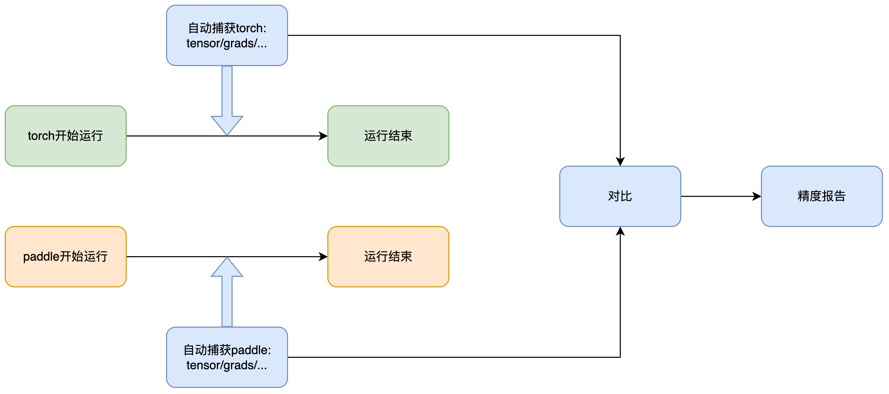

# PaDiff    

**P**addle **A**utomatically **Diff** precision toolkits.

## 简介

PaDiff 是基于 PaddlePaddle 与 PyTorch 的模型精度对齐工具。传入 Paddle 和 Torch 模型，对齐训练中间结果以及训练后的模型权重，并提示精度 diff 第一次出现的位置。

本工具支持通过以下方法进行对比（任选其一）：

- 通过单行命令，自动完成 PaDiff 代码注入 --> 生成临时运行脚本 --> 自动运行 --> 监控运行过程并 dump 数据 --> 自动对比并返回结果。
这种方式不需要手动修改代码，只需要妥善设置配置文件。但使用此方法时需要将 `paddlepaddle` 和 `torch` 包安装在**同一环境**中，可能会出现版本冲突

- 手动修改 Paddle 和 PyTorch 脚本，并在**分别**运行（不需要同时）这两个脚本，根据脚本 PaDiff 会分别监控运行过程并 dump 数据，最后手动调用 API 接口对比数据，得到对齐结果。两次运行可以在**两个环境**中，但每个环境中都需要同时存在 `paddlepaddle` 和 `torch` 包

- 参考[旧版本特性（v0.2版本）](#readme-v02) 使用 auto_diff 接口进行对齐，这种方法需要将 Paddle 和 PyTorch 放在同一个文件中，同时将 `paddlepaddle` 和 `torch` 包安装在同一环境中，不仅两个模型的运行过程耦合，代码修改量也比较大，因此**不推荐**此用法


## 安装

当前推荐通过源码安装，本工具依赖 `paddlepaddle` 和 `torch`，但在同一个环境中安装这两个包时，可能存在依赖冲突。请通过如下命令安装本工具后，根据 [paddlepaddle官网](https://www.paddlepaddle.org.cn/install/quick?docurl=/documentation/docs/zh/develop/install/pip/linux-pip.html) 和 [pytorch官网](https://pytorch.org/get-started/locally/) 自行安装 `paddlepaddle` 和 `torch`

```sh
python -m pip install -e . -i https://pypi.tuna.tsinghua.edu.cn/simple
```

## 快速开始

### 使用单行命令对齐

将命令写入配置文件后，通过如下命令运行

```sh
python -m padiff.cli --config padiff_config.yaml
```

完整文件示例请参考 [配置文件说明文档](docs/CLIConfig.md)，同时，运行命令前，请运行 `python -m padiff.cli -h` 获取更详细的参数说明。

### 在不同环境中手动运行



如上图所示，PaDiff 支持分别监控 Paddle 和 PyTorch 模型的运行流程，并自动捕获输出、参数梯度、权重等信息。手动修改脚本，仅需找到原代码中模型被调用的代码，使用 `with PaDiffGuard(...)` 包裹，然后分别运行两个项目中的模型训练/推理脚本即可。

`PaDiffGuard` 参数说明请参考 [PaDiffGuard API](docs/api/PaDiffGuard.md)

在两个项目运行结束后，会在两个项目生成 "your_project/padiff_dump/model_name" 的目录，该目录下会保存一些用于对比的数据文件。

之后按照如下脚本，手动调用 `compare_dumps(...)` 进行比较。

```python
# compare_dumps.py
from padiff.utils import logger
from padiff import compare_dumps

if __name__ == "__main__":
    logger.reset_dir( "./padiff_log")

    cfg = {
        "atol": 1e-6,
        "rtol": 1e-4,
        "compare_mode": "abs_mean",
        "action_name": "loose_equal",
    }

    pt_dump_path = "torch_proj/padiff_dump/model_torch"
    pd_dump_path = "paddle_proj/padiff_dump/model_paddle"
    compare_dumps(pt_dump_path, pd_dump_path, cfg)
```


## log 设置

#### 开启 debug 模式

为了获取更多 log 信息，可以设置环境变量 `export PADIFF_LOG_LEVEL=DEBUG`，或使用命令运行 `PADIFF_LOG_LEVEL=DEBUG python -m padiff.cli ...`

#### 开启静默模式

为了保持控制台信息简洁，可以设置环境变量 `PADIFF_SILENT=1`，此模式下仅保存 log 文件，不在控制台输出 log 信息

<a id="readme-v02"></a>
## 旧版本特性（v0.2版本）

### 使用 auto_diff 接口和其它方法

请查阅此文档[auto_diff 接口和其它方法](docs/README.md)
