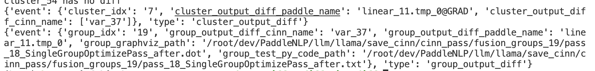

## 快速开始

### 安装依赖

`python -m pip install -r requirments.txt`

### 一键运行模式

**example**
```python
import os
from analyze import auto_diff
from env import Env


def run(run_script, base_env, cinn_env):
    run_env = Env(run_script, base_env, cinn_env)
    run_env.run_base_model() #可以注释掉选择不运行base model
    run_env.run_cinn_model() #也可以注释掉选择不运行cinn model
    auto_diff(run_env.base_path, run_env.cinn_path, rtol=1e-3, atol=1e-3)


if __name__ == '__main__':
    run_script = "/root/dev/PaddleNLP/model_zoo/bert/run_bert.sh"
    run_script = "/root/dev/PaddleClas/run_resnet.sh"
    run(run_script, None, None)
```
**run_script**
模型运行脚本，使用时提供脚本路径，需在模型内部实现好动转静

**base_env**
模型基线运行的环境变量
初始配置为
```python
{
    "CUDA_VISIBLE_DEVICES" : "0",
    "NVIDIA_TF32_OVERRIDE" : "1",
    "CUDA_LAUNCH_BLOCKING" : "1",
    "FLAGS_save_static_runtime_data" : "1",
    "FLAGS_static_runtime_data_save_path" : "./",
    "FLAGS_cudnn_deterministc" : "1",
    "FLAGS_cinn_cudnn_deterministc" : "1",
    "FLAGS_prim_all" : "true"
}
```

**cinn_env**
模型接入编译器运行的环境变量
初始配置为
```python
{
    "FLAGS_use_cinn" : "1",
    "FLAGS_deny_cinn_ops" :"",
    "FLAGS_use_reduce_split_pass" : "1",
    "FLAGS_nvrtc_compile_to_cubin" : "0",
    "FLAGS_cinn_use_op_fusion" : "1",
    "FLAGS_cinn_parallel_compile_size" : "8",
    "FLAGS_cinn_pass_visualize_dir": "",
}
```

### 手动运行模式

step1: 准备模型运行脚本，跑通动转静+组合算子+编译器

step2: 手动运行动转静+组合算子的基线模型

基线模型运行是需要配置如下环境变量
```
"FLAGS_save_static_runtime_data" : "1",

"FLAGS_static_runtime_data_save_path" : "./base",
```
step3: 手动运行动转静+组合算子+编译器的模型

接入编译器的模型运行需要配置如下环境变量
```
"FLAGS_save_static_runtime_data" : "1",

"FLAGS_static_runtime_data_save_path" : "./cinn",

"FLAGS_cinn_pass_visualize_dir": "./cinn/cinn_pass",
```
step4: 运行模型精度对齐脚本

```python
from analyze import auto_diff

base_path = "/root/dev/PaddleClas/base"
compare_path = "/root/dev/PaddleClas/cinn"
auto_diff(base_path, compare_path, atol=0, rtol=0)
```

模型运行脚本环境变量配置例子
``` shell
#!/bin/bash
export CUDA_VISIBLE_DEVICES=5
export NVIDIA_TF32_OVERRIDE=1
export CUDA_LAUNCH_BLOCKING=1
export FLAGS_save_static_runtime_data=true
export FLAGS_cudnn_deterministc=1
export FLAGS_cinn_cudnn_deterministc=1
# export FLAGS_check_nan_inf=1
rm -rf ./cinn/*
export FLAGS_static_runtime_data_save_path="./cinn/"

# 跑 动转静 + 组合算子时打开下面这1行
export FLAGS_prim_all=true
# 跑 动转静 + 组合算子 + CINN时打开下面这6行
export FLAGS_use_cinn=1
export FLAGS_deny_cinn_ops="reduce_sum"
export FLAGS_use_reduce_split_pass=1
export FLAGS_nvrtc_compile_to_cubin=0
export FLAGS_cinn_use_op_fusion=1
export FLAGS_cinn_parallel_compile_size=8


# # before and after cinn program and graph pass(including group opfusion pass) in each sub-graph
rm -rf ./cinn_pass/*
export FLAGS_cinn_pass_visualize_dir="./cinn/cinn_pass/"

task_name_or_path="llama_output"
python run_pretrain.py \
    --model_type "llama" \
    ...
```

## 运行结果



## 功能扩展
1. 【开发中】参数式启动
2. 【开发中】中间变量读取展示接口

更多功能正在研发中...


